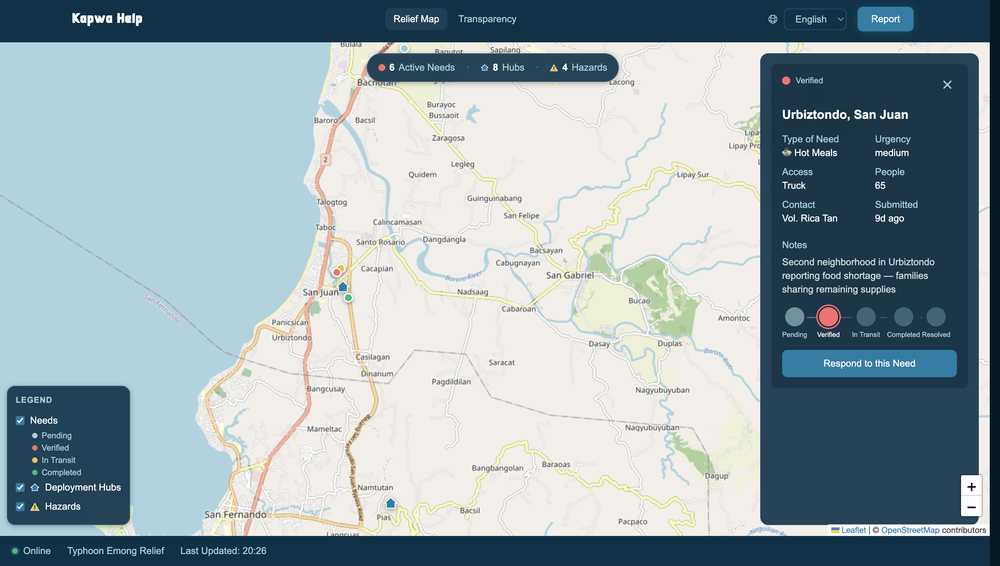

# LUaid.org

**Open-source disaster relief operations for La Union, Philippines.**

When Typhoon Emong hit La Union in 2025, volunteers self-organized across municipalities to distribute meals, relief goods, drinking water, and medical supplies. Coordination happened over group chats. Tracking happened in spreadsheets — when it happened at all. LUaid was born out of that experience: a transparency and coordination tool built by the people who were on the ground, designed so the next disaster response starts where this one left off.

LUaid is a Progressive Web App that tracks donations, volunteer deployments, and aid distribution in real time. It's built for offline-first use in low-connectivity disaster zones, runs entirely on free-tier services, and supports English, Filipino, and Ilocano.

We publish this software openly in the hope that it's useful for disaster relief operations in your community too.



## What It Does

- **Transparency dashboard** — live tracking of donations, beneficiaries, volunteer counts, and deployment activity across organizations
- **Interactive deployment map** — GPS-tagged aid deliveries visualized on a Leaflet/OpenStreetMap layer
- **Offline-capable PWA** — the full app shell is cached on-device via service worker, works without internet
- **Multilingual** — English, Filipino, and Ilocano with a one-click language switcher
- **Zero-budget infrastructure** — Supabase free tier for the database, Vercel for hosting, no paid services

## Quick Start

```bash
git clone https://github.com/r0droald/LUaid.git
cd LUaid
npm install
npm run dev
```

You'll need a `.env.local` file with Supabase credentials — see [docs/setup.md](docs/setup.md) for the full setup guide, including shared database access and seed data details.

## Tech Stack

| Layer | Tool |
|-------|------|
| App | [Vite](https://vitejs.dev/) + [React](https://react.dev/) + [TypeScript](https://www.typescriptlang.org/) |
| Database | [Supabase](https://supabase.com/) (Postgres + Row Level Security) |
| Styling | [Tailwind CSS v4](https://tailwindcss.com/) with semantic design tokens |
| Maps | [Leaflet](https://leafletjs.com/) + [OpenStreetMap](https://www.openstreetmap.org/) |
| i18n | [react-i18next](https://react.i18next.com/) |
| PWA | [vite-plugin-pwa](https://vite-pwa-org.netlify.app/) (Workbox) |
| Testing | [Vitest](https://vitest.dev/) + [React Testing Library](https://testing-library.com/) |

For architecture decisions, database schema, and system design details, see [docs/architecture.md](docs/architecture.md).

## Get Involved

LUaid is a volunteer-driven project and we welcome help from anyone — developers, designers, writers, translators, relief coordinators, or anyone who wants to contribute. Every skill set has a place here.

Check the [Issues](https://github.com/r0droald/LUaid/issues) tab to find something to work on, or open a new issue if you have ideas. If you're a developer, [docs/setup.md](docs/setup.md) will get you running locally in a few minutes.

## Documentation

| Doc | What's inside |
|-----|---------------|
| [Architecture](docs/architecture.md) | System design, database schema, query functions, key decisions, what's built vs planned |
| [Local Setup](docs/setup.md) | Environment setup, seed data, testing, troubleshooting |
| [Design System](docs/design-system.md) | Color tokens, typography, component patterns |
| [i18n Guide](docs/i18n.md) | Translation workflow, script usage, adding new languages |
| [Project History](docs/project-history.md) | Origin story, goals, and project direction |

## License

MIT License — see [LICENSE](LICENSE). We encourage community collaboration and repurposing of this work for disaster relief anywhere.
